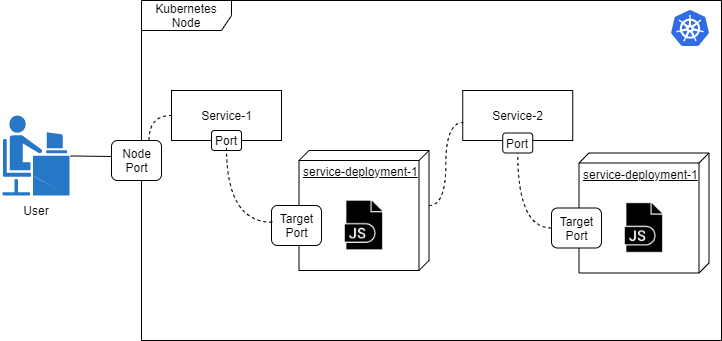

# Technical Challenge

This repository shows the result of the technical challenge. It contains two dockerized micro services built in NodeJS and the configuration files to deploy them locally using Minikube.

## NodeJS Micro Services

As the exercise instructed, there are two micro services, micro-service-1 and micro-service-2. micro-service-1 will recieve a request with a message and together they will respond with the inverted message and a random number. micro-service-2 can only be called by micro-service-1 and has the task of inverting the message. They each also have a Dockerfile to run them inside containers and deploy them easily to Minikube.


## Deployment Environment

The project was created on Ubuntu 20.04 and it has the following requirements to run:

* [npm](https://www.npmjs.com/get-npm)
* [Docker](https://docs.docker.com/engine/install/)
* [Minikube](https://minikube.sigs.k8s.io/docs/start/)

The project was tested on the default Minikube configuration

## Deployment Configuration

Each of the services has two configuration files for Minikube, a deployment yaml and a service yaml. The deployment configuration file deploys the Docker image created for the service on a pod. The service configuration file exposes the services so that they can be discovered. micro-service-1 can receive POST requests from outside the Kubernetes environment while micro-service-2 cannot. micro-service-2 will be discovered by micro-service-1 using the DNS provided by Minikube.



## Running the Project

To run the project the Minikube environment should be set up:

```bash
minikube start
```

```bash
eval $(minikube docker-env)
```

Then the images should be built, deployed and the services should be created:

```bash
docker build -t micro1 micro-service-1/
docker build -t micro2 micro-service-2/
kubectl apply -f micro-service-1/service-1-deployment.yaml
kubectl apply -f micro-service-1/service-1.yaml
kubectl apply -f micro-service-2/service-2-deployment.yaml
kubectl apply -f micro-service-2/service-2.yaml
```

To make this process quicker and automatic, the deployment.sh script has been added.
The final step is creating the tunnel to expose the micro service 1:

```bash
minikube service service-1 --url
```

The deployment script also includes this line. It will output the URL to access the service. The service can be tested using a tool like Postman or just by sending a request with curl only replacing the service ip in the following command:

```bash
curl -i -X POST -H 'Content-Type: application/json' -d '{"message":"abcde"}' <service ip>/api
```

The response body should be:

```json
{"message":"edcba", "rand":"<random number between 0-1>"}
```

## Deploying on a Cloud Server

Deploying these services on AWS is possible by using [EKS](https://aws.amazon.com/eks/) and [ECS](https://aws.amazon.com/ecs/). With these tools it is possible to deploy Docker images into a Kubernetes Cluster. The configuration for the cluster is composed by a VPC with a private and a public subnet. There can be multiple of each on different availability zones to create redundancy.

The public subnets will be exposed to the user through an Internet Gateway and it will contain a Load Balancer pointing to our nodes. The private subnets will contain the nodes with our services and will connect to the Load Balancers through a NAT Gateway. To create an EKS Cluster [these resources](https://docs.aws.amazon.com/eks/latest/userguide/getting-started-console.html) can be useful.


## CI/CD Pipeline

AWS has useful tools for creating pipelines under their [Developer Tools](https://aws.amazon.com/products/developer-tools/) section. In particular Code Pipeline will be an useful service. With this tool the code can be easily accessed from most repository services. Code Pipeline can also set up a build step by using Code Build to create the Docker image that will be stored in the registry and used by the EKS Cluster. The deployments can be managed using Code Deploy.


To minimize the downtime AWS has the option to select different deployment strategies. A [blue/green](https://aws.amazon.com/blogs/compute/bluegreen-deployments-with-amazon-ecs/) deployment strategy can reduce downtime by setting up the updated version of the services first and then routing the traffic to it once it is healthy. This also enables rolling back to the previously deployed version if the new environments fails for any reason. As mentioned on the article, there is also the Canary strategy. This one is more suited towards deploying and update to a subset of micro services or to a subset of users. It will help reduce downtime by slowly diverting the traffic to the new versions.
